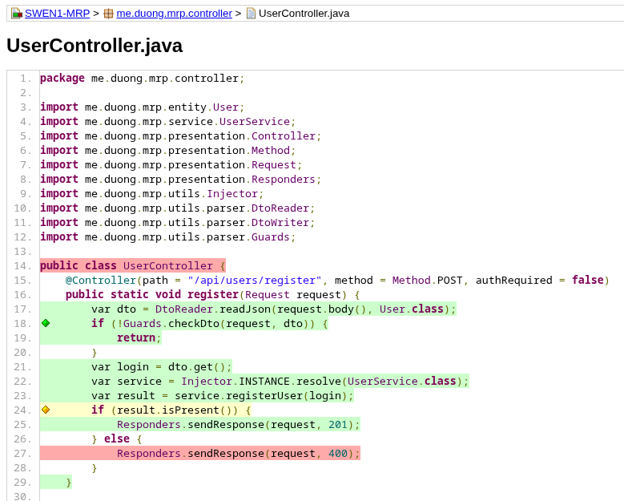
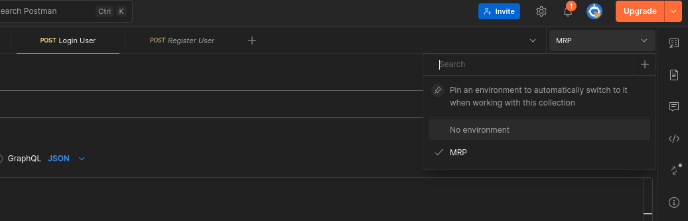

# SWEN1 Semester Projekt
Duong Philip

# Table of Contents

- SWEN1 Semester Projekt
    - Database Diagram (von DBeaver)
    - Model Class Diagram (von IntelliJ IDEA)
    - JSON Mapping
    - Dependency Injection
    - Next Steps bis zum Final Hand-in
    - Postman Environment
    - Github Actions
    - Github Repo Link


### Database Diagram (von DBeaver)


### Model Class Diagram (von IntelliJ IDEA)

(User-Model könnte sich vielleicht noch ändern)


Hier wird eine abstrakte, generische Klasse "Entity" an die jeweiligen Model-Klassen vererbt:

```java title:Entity.java
package me.duong.mrp.entity;  
  
public abstract class Entity<T> {  
    protected T id;  
  
    public T getId() {  
        return id;  
    }  
    public Object setId(T id) {  
        this.id = id;  
        return null;  
    }
}
```

Auch im BaseRepository werden Generics (alle Entities mit einem Integer ID sind erlaubt) und Functional Interfaces (in diesem Fall Consumer = 1-Parameter Methode ohne Rückgabewert) verwendet:

```java title:BaseRepository.java
public abstract class BaseRepository<T extends Entity<Integer>> {  
    protected final DbSession session;  
  
    public BaseRepository(DbSession session) {  
        this.session = session;  
    }  
    protected T insert(T entity, String dml, CheckedConsumer<PreparedStatement> bindParams) {  
        try {  
            var prepared = session.prepareStatement(dml, Statement.RETURN_GENERATED_KEYS);
            bindParams.accept(prepared);  
            int result = prepared.executeUpdate();  
            var key = prepared.getGeneratedKeys();  
            if (result != 1 || !key.next()) {  
                throw new DbException("Failed to insert entity");  
            }
            var id = key.getInt(1);  
            if (entity != null) {  
                entity.setId(id);  
            }
            return entity;  
        } catch (SQLException exception) {  
            Logger.error("Failed to insert entity: %s", exception.getMessage());  
            throw new DbException("Failed to insert entity", exception);  
        }
    }
    ...
}
```

```java
public interface UserRepository {
    Optional<User> findUserById(int id);
    ...
}
```

```java title:UserRepositoryImpl.java
public class UserRepositoryImpl extends BaseRepository<User> implements UserRepository {  
    public UserRepositoryImpl(DbSession session) {  
        super(session);  
    }  
    @Override  
    public Optional<User> findUserById(int id) {  
        return super.findBy("""  
                        SELECT * FROM users WHERE id = ?
		                """,  
                prepared -> prepared.setInt(1, id),  
                UserRepositoryImpl::mapUser);  
    }
...
```

Auch wenn die Methoden von PreparedStatement ein SQLException werfen und von den Methoden im BaseRepository aufgefangen werden, muss man bei der Übergabe mit dem normalen Consumer Type das try-catch verwenden - kann jedoch mit einem eigenen Consumer Interface vereinfacht werden (die Methode "accept" muss vorhanden sein, sonst wird es nicht als Consumer richtig erkannt):

```java title:CheckedConsumer.java
@FunctionalInterface  
public interface CheckedConsumer<T> {  
    void accept(T t) throws SQLException;  
}
```

```java
prepared -> {
	try {
		prepared.setInt(1, id);
	} catch (SQLException e) {
		...
	}
}
```
wird zu
```java
prepared -> prepared.setInt(1, id)
```


### JSON Mapping

Normalerweise gibt es einen Entity und einen zugehörigen DTO (damit z.B. die interne User-ID oder das User-Passwort nicht als JSON nach außen gelangt), aber mit dem Jackson ObjectMapper kann man für bestimmte Felder bestimmen, ob es von bzw. zu JSON umgewandelt wird:

```java title:Views.java
public class Views {  
    public static class Public {  
    }   
    public static class Testing extends Public {  
    }
}
```

Eines der beiden Views wird der @JsonView Annotation und der ObjectMapper übergeben:

```java title:User.java
public class User extends Entity<Integer> implements BaseValidator {  
    private String username;  
    private String email;  
    private String password;  
    private String salt;  
    private String favoriteGenre;  

    @JsonView(Views.Testing.class)  
    public String getPassword() {  
        return password;  
    }  
    @JsonProperty("password")  
    public User setPassword(String password) {  
        this.password = password;  
        return this;  
    }
    
    ...
}
```

In diesem Fall wird das Passwort nicht im JSON zu sehen sein:
```java
private static ObjectWriter publicWriter() {  
    var mapper = new ObjectMapper();  
    mapper.registerModule(new SimpleModule().addSerializer(
	    OffsetDateTime.class, 
	    new OffsetDateTimeSerializer()
	));  
    return mapper.writerWithView(Views.Public.class);  
}
```

Mit diesem ObjectWriter wird das Passwort im JSON dabei sein:
```java
public static ObjectWriter testingWriter() {  
    var mapper = new ObjectMapper();  
    mapper.registerModule(new SimpleModule().addSerializer(
	    OffsetDateTime.class, 
	    new OffsetDateTimeSerializer()
	));  
    return mapper.writerWithView(Views.Testing.class);  
}
```


### Dependency Injection

Damit man z.B. den Service-Instanz bei einem Controller einfacher mit einem anderen austauschen kann (für z.B. Unit-Testing mit einem Mockito-Instanz), gibt es die Injector-Klasse:

```java title:Injector.java
public enum Injector {  
    INSTANCE;  
    private final Map<Class<?>, Object> injectors = new HashMap<>();  
  
    public <T> void register(Class<T> clazz, Object object) {  
        injectors.put(clazz, object);  
    }  
    public <T> T resolve(Class<T> clazz, Object... args) {  
        try {  
            if (injectors.containsKey(clazz)) {  
                var value = injectors.get(clazz);  
                if (value instanceof Class<?> valueClass) {  
                    var parameters = Arrays.stream(args)
		                    .map(Object::getClass)
		                    .toArray(Class[]::new);  
                    var instance = valueClass.getDeclaredConstructor(parameters)
		                    .newInstance(args);  
                    return clazz.cast(instance);  
                }
                if (value instanceof Supplier<?> supplier) {
                    return clazz.cast(supplier.get());
                }
                return clazz.cast(value);  
            }        
        } catch (NoSuchMethodException | 
			    InvocationTargetException | 
			    InstantiationException | 
			    IllegalAccessException exception) {  
            Logger.error("Failed to resolve dependency: %s", exception.getMessage());  
            throw new RuntimeException("Failed to resolve dependency", exception);  
        }        
        throw new RuntimeException("No dependency found for " + clazz.getName());  
    }
}
```

Dependencies werden mit register(Class, Object) registriert - wird eine ".class" im 2. Parameter übergeben, dann wird beim resolve(Class) immer eine neue Instanz via Java Reflections erzeugt (bei einer tatsächlichen Instanz wird es beim resolve(Class) direkt zurückgegeben):
```java title:UserControllerTest.java
public class UserControllerTest {  
    private static final UserService USER_SERVICE = mock(UserService.class);
  
    @BeforeAll  
    public static void setUp() {  
        Injector.INSTANCE.register(UserService.class, USER_SERVICE);  
        RestServer.INSTANCE.start();
    }
    ...
}
```

Diese Service-Instanz wird dann dem UserController mit resolve() übergeben:
```java title:UserController.java
public class UserController {  
    @Controller(path = "/api/users/register", method = Method.POST, authRequired = false)  
    public static void register(Request request) {  
        var dto = DtoReader.readJson(request.body(), User.class);  
        if (!Guards.checkDto(request, dto)) {  
            return;  
        }        
        var login = dto.get();  
        var service = Injector.INSTANCE.resolve(UserService.class);  
        var result = service.registerUser(login);  
        if (result.isPresent()) {  
            Responders.sendResponse(request, 201);  
        } else {  
            Responders.sendResponse(request, 400);  
        }
    }
}
```

### Jacoco: Unit Testing

Mit Jacoco kann man überprüfen, wie viel Code die Unit Tests abdecken
und wo noch Unit Tests fehlen könnten.
z.B: deckt der UserControllerTest derzeit nur einen if-Zweig ab.



### Next Steps bis zum Final Hand-in

- Es wäre besser, die Genres beim Media in eine Lookup-Tabelle auszulagern (dadurch kann man auch bestimmen, welche Tags erlaubt sind bzw. existieren)
- Eventuell HttpStatus Enums hinzufügen statt Integers zu übergeben
- Recommendations und Leaderboard fertig implementieren
- mehr Unit-Tests für jeden Layer (Controller, Service, DAL/Repository) hinzufügen


### Postman Environment

Damit der Auth Token nach dem Login für alle anderen Request verwendet wird,
muss in Postman ein Environment erstellt werden:



### Github Actions

Derzeit wird bei jedem Push "maven:verify" für die Unit Tests ausgeführt:


### Github Repo Link

https://github.com/if25b190/MRP
